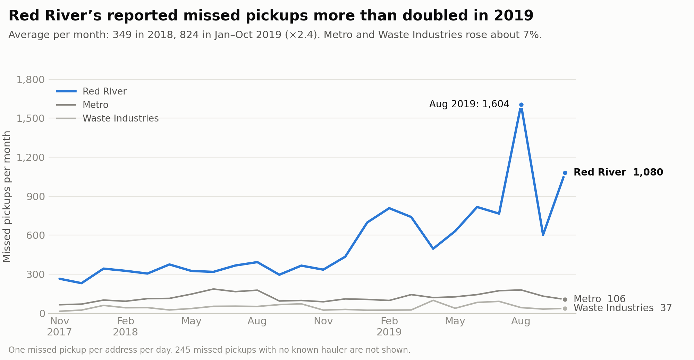
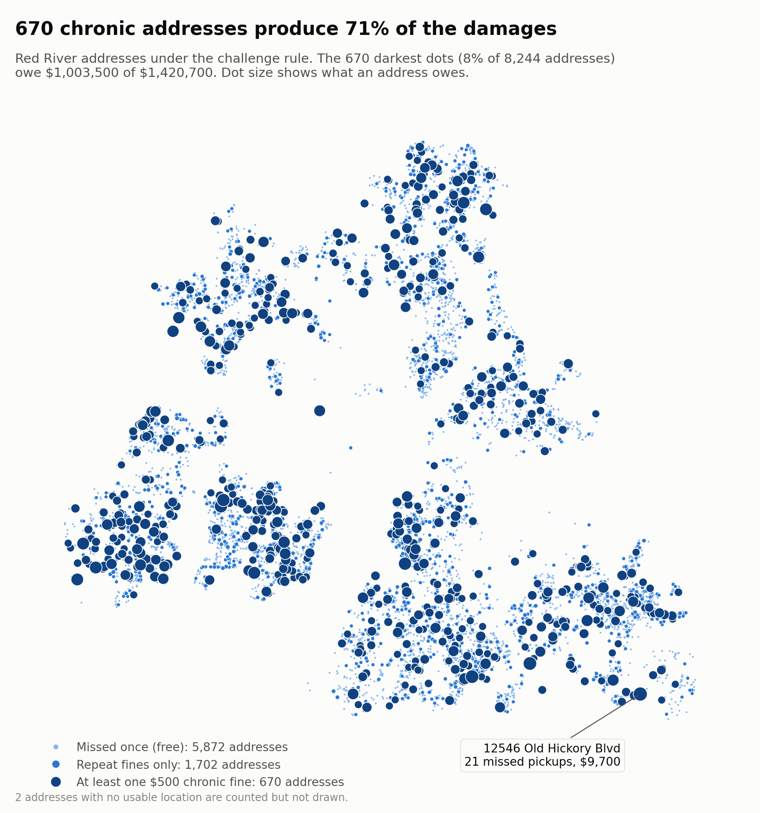
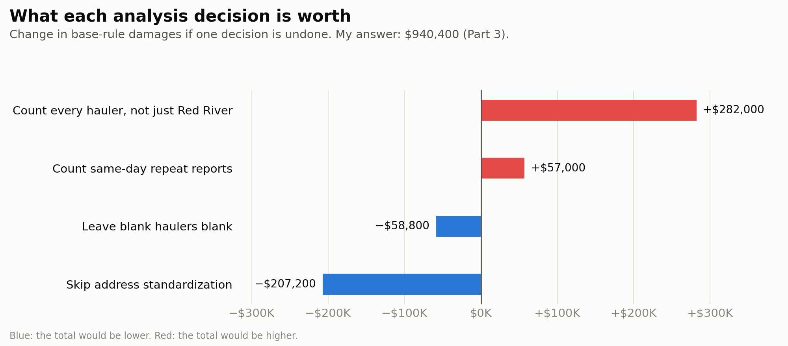

# Missed Trash Pickups: What Red River Owes Metro Nashville

**Juan Zavala** · AI for Analytics · built with Claude as a pair programmer

Metro's contract with Red River Waste Solutions charges liquidated damages for repeat missed trash pickups at the same address. This project turns 20,226 hubNashville service requests (Nov 1, 2017 to Nov 1, 2019) into a dollar figure for each version of the rule.

| | Base rule (Part 3) | Challenge rule (Part 4) |
|---|---:|---:|
| Rule | 1st miss at an address free, every later miss $200 | Same, but the 3rd or later miss within 6 months is $500 |
| Missed pickups (Red River) | 12,946 | 12,946 |
| Free first misses | 8,244 | 8,244 |
| $200 fines | 4,702 | 3,101 |
| $500 fines | none | 1,601 |
| **Total damages** | **$940,400** | **$1,420,700** |

The least certain step is filling in blank hauler names from other requests at the same address. Without it, the base rule gives $881,600 and the challenge rule $1,313,600. The known gaps in the data all push the totals down (see [What the data can't tell us](#what-the-data-cant-tell-us)).

**Start here:**

* [`trash_haulers_analysis.ipynb`](trash_haulers_analysis.ipynb): the full analysis, Parts 2 to 4, with every check. GitHub shows it with all outputs.
* [`part1_planning.md`](part1_planning.md): the plan, written before any code.
* [`red_river_damages_calculator.html`](red_river_damages_calculator.html): an interactive calculator. Download it and open it in any browser. Change the fine amounts, the 6-month window or four of the data decisions, and the totals, map, monthly chart and per-address ledgers recalculate.

---

## Three findings

### 1. Red River's missed pickups more than doubled in 2019



Red River averaged 349 missed pickups a month in 2018 and 824 a month in January to October 2019, peaking at 1,604 in August 2019. Metro's and Waste Industries' own numbers rose only about 7% over the same period, so the jump is specific to Red River. As a result, **2019 accounts for $1,081,300 (76%) of the challenge-rule damages** and 1,253 of the 1,601 $500 fines. The data shows *when* it happened, not *why*.

### 2. A small set of chronic addresses drives most of the money



Of the 8,244 addresses Red River missed, 5,872 (71%) were missed only once and owe nothing. **670 addresses (8%) reached the $500 chronic fine at least once, and they account for $1,003,500 (71%) of the challenge-rule damages.** The worst, 12546 Old Hickory Blvd, was missed 21 times and owes $9,700.

### 3. The data decisions move the answer by hundreds of thousands of dollars



Each bar re-runs the base rule with one decision from Parts 1 and 2 undone.

* **Address standardization is the biggest data-cleaning step.** Without it, the same house written two ways looks like two different addresses, each with its own free first miss. That hides $207,200 in fines.
* **The Red River filter** keeps out $282,000 for misses by other or unknown haulers, which this contract doesn't cover.
* **The same-day rule** removes $57,000 that came only from one miss being reported more than once.

---

## How Claude was used

Claude (Anthropic's AI, working in Cowork) read the data, proposed approaches, wrote and ran the code, and built the checks. I set the direction, reviewed each plan before any code was written, and signed off on the judgment calls. Each part of the notebook follows the order the assignment asks for: Claude explains its approach in plain English, the plan is reviewed, then code runs, then a check confirms it.

**Where the first idea was wrong, and what caught it.** These are recorded as `[REVIEW]` notes in the notebook.

| First idea | What testing on the real data showed | What changed |
|---|---|---|
| Turn every WEST into W when cleaning addresses | West End Ave is a real street name and would have been rewritten | Shorten a direction only when it's the last word (`19TH AVENUE NORTH` → `19TH AVE N`) |
| Cutting at the first comma removes the city and ZIP | Some rows have no comma: `2304 EASTLAND AVE NASHVILLE TN 37206` | Also strip a trailing city/state/ZIP |
| Fill blank haulers from the `Trash Route` column (one of two options in Part 1) | Only 32 of the 716 blank-hauler missed-pickup rows have a route | Used Part 1's other option: fill from other requests at the same address (542 of 901 blanks filled, across all request types) |
| "pandas methods are faster than a custom function" | Timed it: a careful custom function was about as fast, and a naive one was roughly 2 to 3 times slower | Kept pandas for readability. The real speed gains came in Parts 3 and 4. |
| Claude ranked a self-merge as slower than `rolling()` for the 6-month window | Timed on this data, the self-merge was several times *faster* than `rolling()` | Chose `shift(2)`, the fastest of all five approaches (about 0.01 seconds) |
| A validation check for leftover city names | It flagged `LAUSANNE DR`, because "LAUSANNE" contains the letters USA | Fixed the check (whole-word match) |
| The cleaned addresses contain no city names | A second Claude agent, asked to fact-check everything, found 2 addresses still ending in `ANTIOCH` with no ZIP | Strip a city name that follows the street type. The totals rose by $400 (base) and $1,000 (challenge) to the figures shown here. |

**The judgment calls a person has to own.** Each one changes the dollar amount, so each is written down in the notebook:

* Only Red River's misses are fined.
* General complaints are left out, even when they mention a miss.
* Different apartment units are different premises.
* "6 months" means calendar months, with both ends of the window included.

## How the numbers were checked

* **Every $500 flag is confirmed by a plain brute-force loop, row for row.** `rolling('182D')` also matches `shift(2)` row for row when both use a 182-day window.
* **Two independent methods agree on the base rule:** `cumcount` and `value_counts`, with (count − 1) × $200.
* **Addresses were checked by hand:** the busiest Red River address (21 misses, $4,000 under the base rule), an address reported four times in one day (counted once), and 1005 Noelton Ave walked through miss by miss.
* **Rules that must always hold do hold:** first misses are always $0, $500 only appears from the 3rd miss on, and no address owes less under the challenge rule.
* **The calculator matches the notebook.** Its JavaScript fine engine was tested against a pandas version of the notebook's rules on 44 scenarios, and all 44 matched exactly. Its calendar-month math matched pandas on all 731 dates in the data, shifted back 1 to 12 months (8,772 checks). Its six "Notebook scenarios" buttons each reproduce a notebook total exactly: both rules, plus the four Part 3 sensitivity scenarios.
* **An independent fact-check.** A second Claude agent checked the numbers in this README, the notebook, the Part 1 plan and the calculator against the data. Its first pass reported 12 errors (one applied only to a staging copy, not this repo) and 12 wording problems, including the address bug above. All were fixed. A second pass confirmed the fixes and found one more mislabeled figure, which was also fixed.

## What the data can't tell us

These gaps all push the totals down:

* **Complaints are left out.** Many describe repeated misses as a pattern (6 of 10 in a sample) rather than as one dated miss, so they can't be counted as specific missed pickups.
* **Whole-street misses** count only at the address that called.
* **245 missed pickups have no known hauler**, even after filling.
* **48 missed-pickup rows have no usable address** (9 blank, 39 with no house number).
* **The data starts on Nov 1, 2017.** An address's "first" miss here may not be its first ever.

Filling in blank haulers is the one step that could push the total either way if a fill is wrong. The range at the top shows how much it matters.

## Files

| File | What it is |
|---|---|
| `README.md` | This page |
| `part1_planning.md` | Part 1: the approach, address assumptions and edge cases, before any code |
| `trash_haulers_analysis.ipynb` | Parts 2 to 4: cleaning, missed-pickup rules, both fine rules, all checks |
| `red_river_damages_calculator.html` | Interactive calculator (self-contained, works offline) |
| `data/trash_hauler_report_with_lat_lng.csv` | The source data: 20,226 hubNashville requests |
| `results/red_river_fines_by_address.csv` | One row per Red River address: missed pickups, base and challenge fines, first and last miss |
| `images/` | The three charts above |

## Reproduce it

```bash
pip3 install pandas jupyter
cd submissions/juan_zavala
jupyter nbconvert --to notebook --execute --inplace trash_haulers_analysis.ipynb
```

Or open the notebook in VS Code, pick a Python kernel and choose **Run All**. A full run took about 10 seconds in testing. One timing cell runs the slow loop on a 500-row sample on purpose, to show how slow it is.
